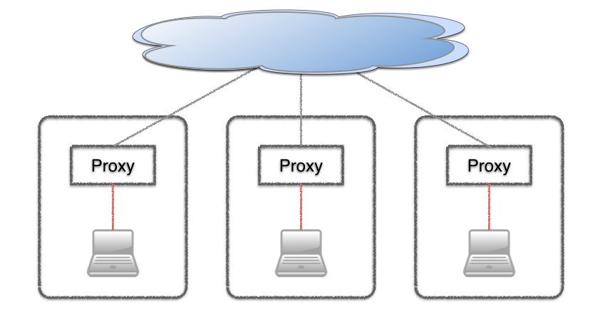

## Switching proxy settings for Maven, git, etc. (on OS X)

I am currently working for two customers at three different locations (and at home). And the proxy settings differ at every location! Sometimes I have to switch from the internal network (with proxy) to my iPhone HotSpot and then back again.

Each time I have to change my proxy settings for 

- git
- Maven
- homebrew/curl/...

I tried to use a local proxy, but had some problems with Outlook (for OS X). 

So I ended up creating a small shell script that checks for the proxy settings in OS X and patch Maven's `settings.xml` and the git configuration (as well as setting the environment variable `http_proxy`). It has served me well in the last weeks, so I wanted to share it.

### Determining the current default network

You can have multiple active network interfaces (e.g. "Wi-Fi" and your iPhone), but one is the 'default' interface, which you can determine with:

    route -n get default

this gives you the _network interface_, e.g. 'en0'.
But for the following steps I need the _network service_ name, i.e. "Wi-Fi", so we need to call

    networksetup -listnetworkserviceorder

which produces something like:

    (1) Wi-Fi
    (Hardware Port: Wi-Fi, Device: en0)
    
    (2) iPhone
    (Hardware Port: iPhone USB, Device: en5)

and grep for the device (and then get the previous line, etc.).

After all this I have the name  default _network service_ name.

### Determining the proxy url

First the proxy URL from the network settings is needed. To retrieve the proxy settings, I use:

    networksetup -getwebproxy "<network service name>"

The above statement prints something like:

    Enabled: Yes
    Server: 10.2.58.17
    Port: 8080
    Authenticated Proxy Enabled: 0

But if I have a `proxy.pac` configured, I need to call 

    networksetup -getautoproxyurl Wi-Fi

which returns the URL for the `proxy.pac` file. This file is a simple JavaScript file that can be parsed with the help of [pacparser](https://code.google.com/p/pacparser/)

When I have the PROXY_HOST and the PROXY_PORT, I can set some environment variables and tell git to use the proxy:

    git config --global http.proxy "http://$PROXY"
    
### Switching Maven proxy settings

The proxy settings for Maven are located in `$HOME/.m2/settings.xml`.
I have created a simple entry for the proxy, the id must be "env-proxy":

    <proxies>
      <proxy>
        <id>env-proxy</id>
        <active>false</active>
        <protocol>http</protocol>
        <host>proxy</host>
        <port>8080</port>
      </proxy>
    </proxies>

This whole block is replaced by the correct settings with the active-flag switched to true.    

### Un-setting

Invoking the script when no proxy can be determined removes/deactivates the proxy settings (git, Maven's settings.xml and environment variables)

### Install

1. install [pacparser](https://code.google.com/p/pacparser/downloads/list)
2. clone [https://github.com/vrvolle/proxy-settings-osx.git](https://github.com/vrvolle/proxy-settings-osx.git) 
3. put the scripts in a directory in your PATH
4. make them executable
5. add a proxy entry "env-proxy" to your settings.xml

### Invoke

To invoke the script, you must `source` it. Otherwise the environment variables will not be set:

    source <path-to-script>/set-http-proxy
